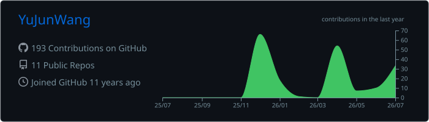
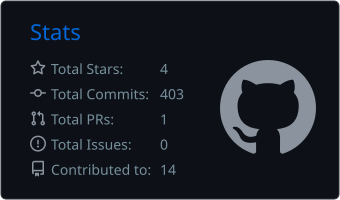

# Hi there, I'm Yu-Jun Wang 👋

### 🏛️ Architecting Data Flow | AI-Augmented Developer
> **「在 AI 抹平技術門檻的時代，決定成果高下的是系統的品味與架構的深度。」**

---

## 💡 數據處理與 AI 協作的「品味」
求學階段曾經在 **資訊工程與建築設計** 兩個不同領域就讀。

對我而言，資料工程不只是編寫腳本，而是一種對數據生命週期的「結構設計」。

我想要將建築設計中對系統架構的嚴謹，轉化為數位世界中的資訊流動。

- **資訊流設計**：如同思考建築學中完整的架構，我追求適當拆解步驟後，打造經過深思熟慮的系統。
- **架構導向的 AI 協作**：將 AI 視為共同開發者，我專注於定義高品質的專案架構，讓 AI 在其中穩定發揮。

---

  
  
  
  

